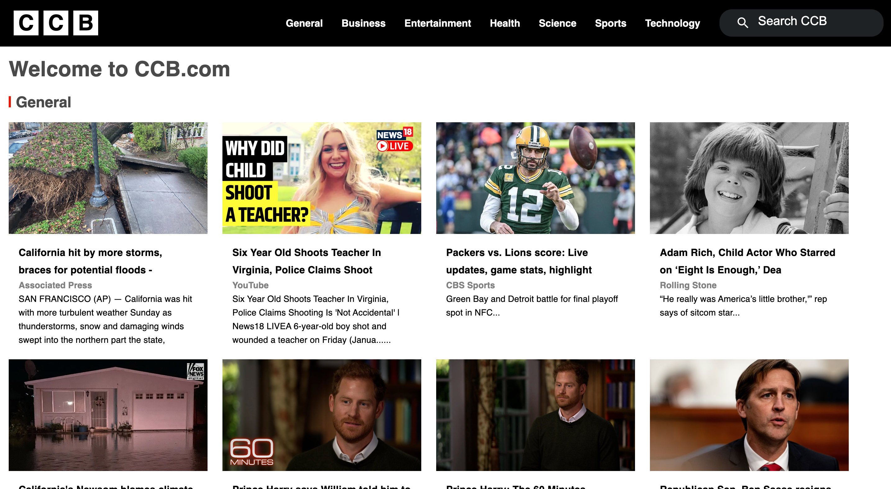
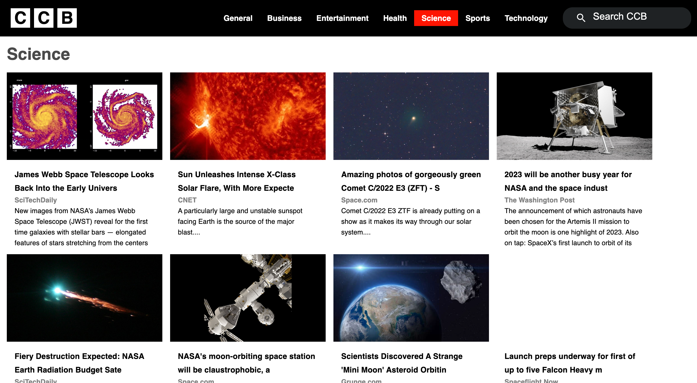
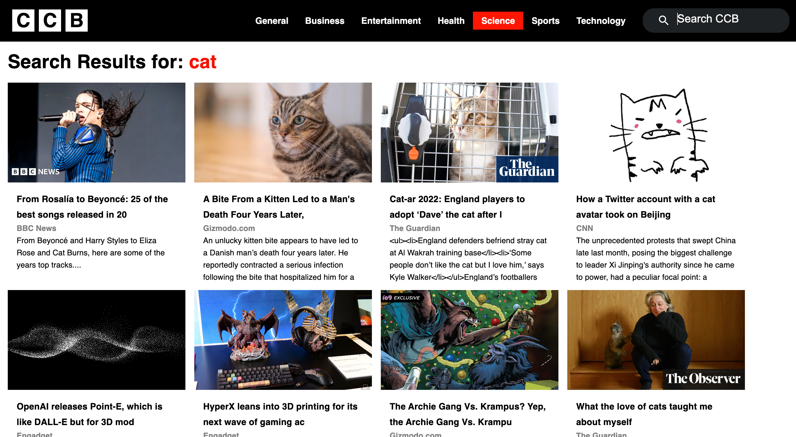

# BBC News Clone 

This is my BBC news clone with React! Please check it out!

## Used Skills, Technology

React, JavaScript, Redux, Axios, Router, Material UI, News API, CSS

## Functions

### `Home`

Displays general top news, and other 2 categories(business, health)
Navbar -> Home Logo, Category menu, Search bar
Responsive

### `Category Details`

Display top 20 news based on the selected category

### `Search`

Display news based on the word you typed on the search bar

